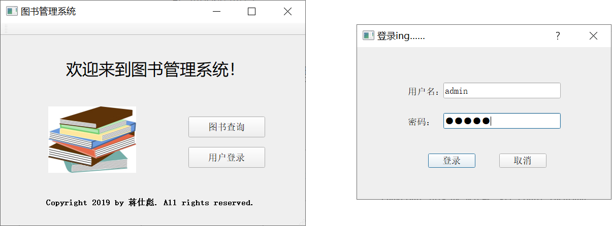
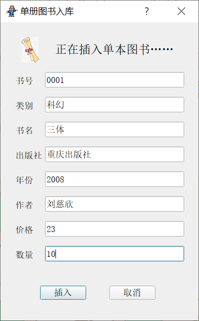
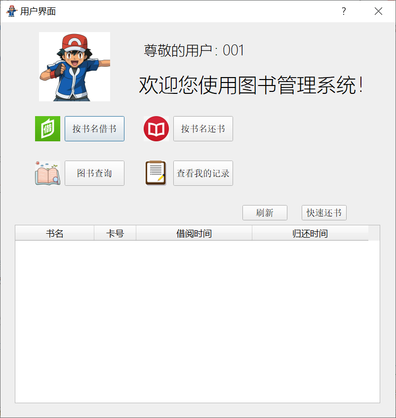
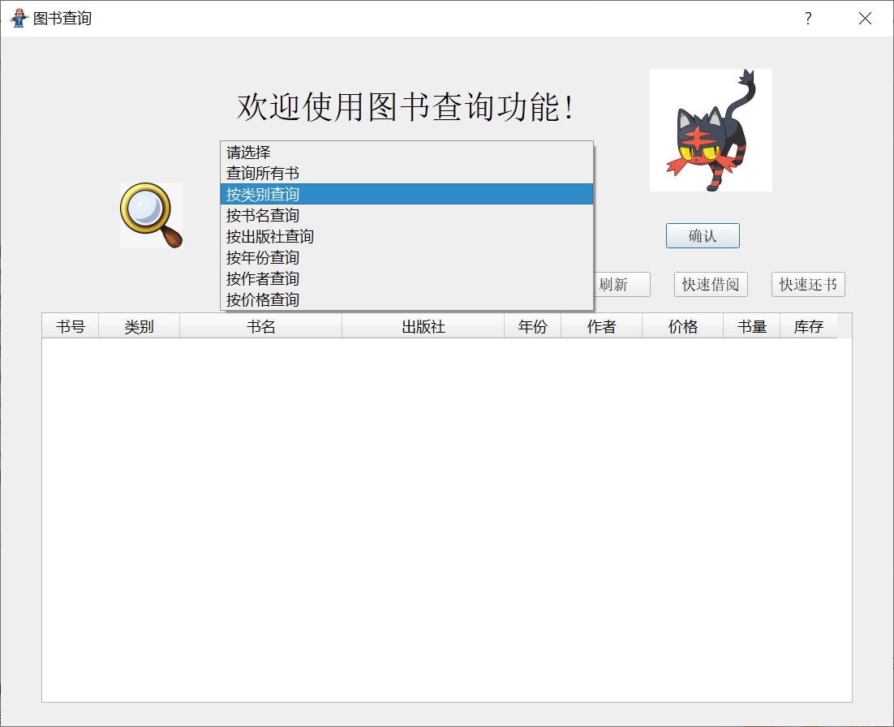
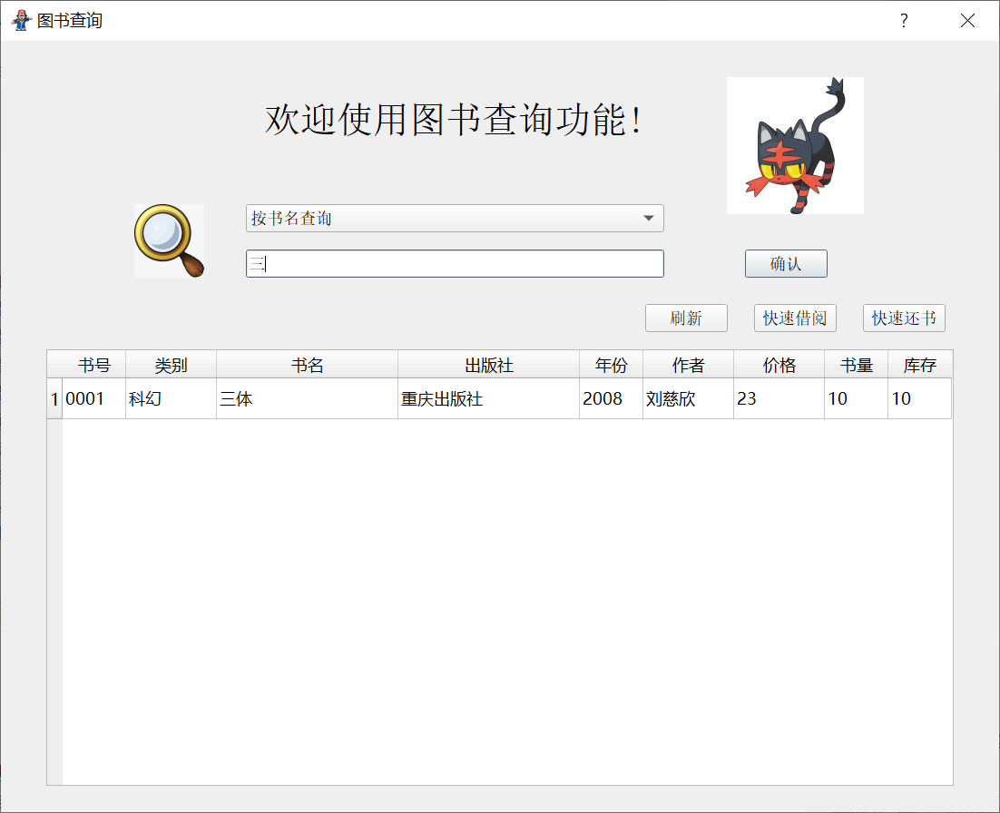
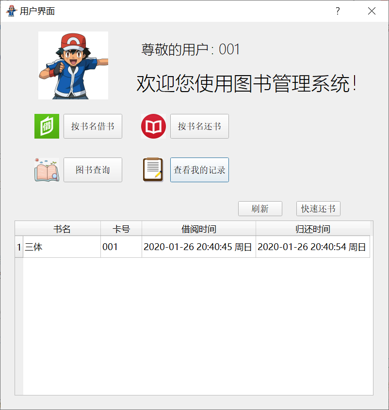

## Simple Library-Manage-System

This is a simple guide.

+ When you open this Library Manage System and put down the *login* button.
  
    
    
	- Note that there exists an **admin** at first who can add cards for people.
	
+ This is the main window for admin...
	
	
	
	- Now we add a new book named *The Three Body Problem* and a new card named *001*.
		
		
+ This is the main window for users...
	
	

	- User or admin can search books in a convenient way.
		
		
		
- **Fuzzy logic** is supported! And user can simply borrow a book by select it and put down the button.
	
	
	
	- Both user and admin can find this record.

		