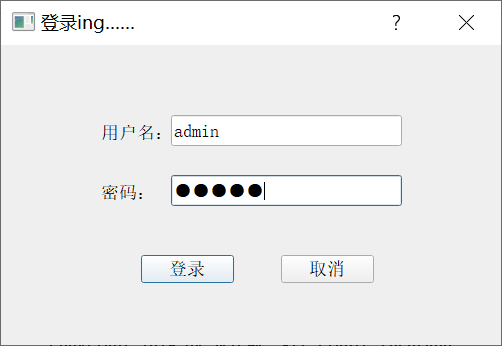
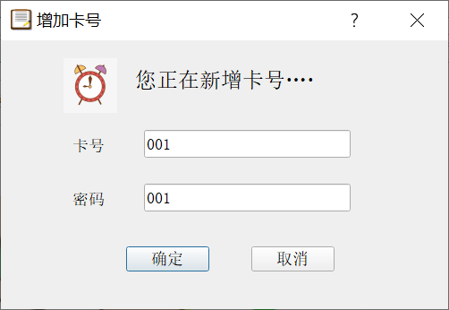
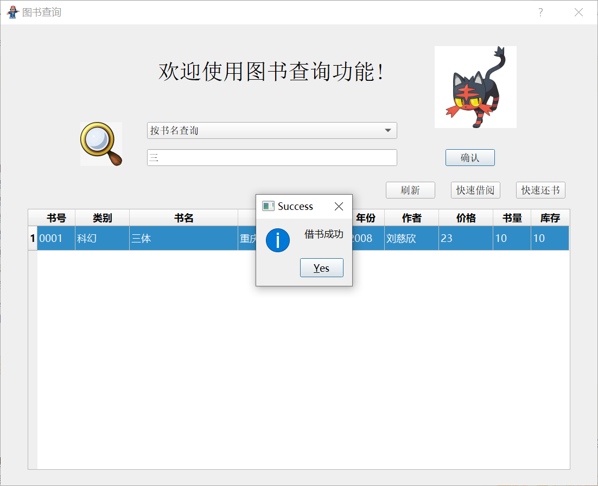

## Simple Library-Manage-System

This is a simple guide.

+ When you open this Library Manage System...
	
+ When you put down the *login* button.
	
	- Note that there exists an **admin** at first who can add cards for people.
+ This is the main window for admin...
	
	- Now we add a new book named *The Three Body Problem*.
		
	- Now we add a new card named *001*.
		
+ This is the main window for users...
	
	- User or admin can search books in a convenient way.
		
	- When searching books by name, **fuzzy logic** is supported!
		
	- User can simply borrow a book by select it and put down the button.
		
	- Both user and admin can find this record.
		